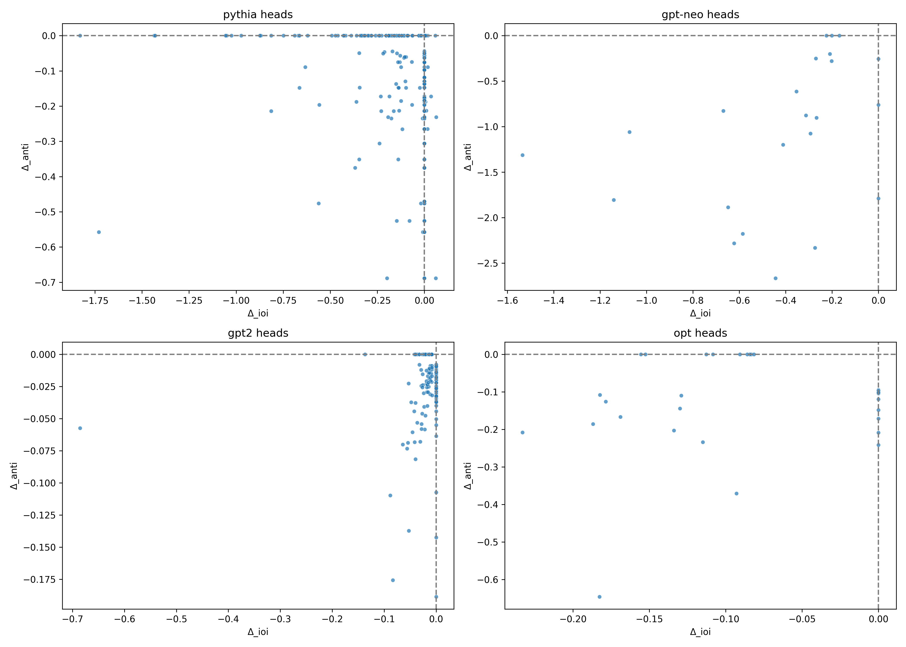

# Circuit-Scaling: Cross-Family Mechanistic Analysis of IOI vs Anti-Repeat Transformer Heads

[](https://opensource.org/licenses/MIT)
[](https://www.python.org/downloads/)

**Author:** Tejas Dahiya (University of Wisconsin–Madison)  
**Status:** Research in progress — targeting submission to a Tier-1 ML conference (NeurIPS / ICLR / ICML)

---

## Overview

This repository contains the complete codebase, datasets, figures, and analysis for a mechanistic-interpretability study exploring:

> **"How do transformer attention heads scale across families when performing IOI (Indirect Object Identification) vs Anti-Repeat suppression?"**

Across **GPT-2**, **Pythia**, **OPT**, and **GPT-Neo**, we identify and classify attention heads into four categories:

| Category | Description |
|----------|-------------|
| **IOI-only** | Heads that primarily contribute to indirect object identification |
| **Anti-repeat-only** | Heads specialized for copy suppression / anti-repetition |
| **Shared dual-function** | Heads exhibiting both IOI and anti-repeat behavior |
| **Weak** | Heads with minimal functional contribution |

We compute cross-family scaling laws, generate full head-level phase plots, perform causal-tracing validation, and introduce a novel **hero-head ablation vs random ablation** experiment demonstrating that functional heads cause meaningful directional effects while random heads do not.

---

## Key Findings

This work presents three novel contributions not found in existing literature:

1. **Cross-family IOI ↔ Anti-Repeat scaling laws** — Correlation patterns evolve predictably with model scale
2. **Shared dual-function heads exist and scale** — A subset of heads perform both tasks, challenging single-function assumptions
3. **Hero-head ablation vs random ablation** — Functional heads show significantly higher ablation impact than random baselines

---

## Repository Structure

```
circuit-scaling/
├── scripts/                    # All experimental scripts
│   ├── scan_logitdiff_copy_suppression.py
│   ├── scan_logitdiff_anti_repeat.py
│   ├── joint_ioi_anti_repeat_all.py
│   ├── analyze_joint_ioi_anti_repeat_all.py
│   ├── export_hero_heads_for_paper.py
│   ├── summarize_head_categories.py
│   ├── plot_layer_histograms_cross_family.py
│   ├── plot_delta_scatter_all_heads.py
│   ├── plot_shared_ioi_antionly_phase.py
│   ├── plot_family_grid.py
│   ├── plot_strong_head_scaling.py
│   ├── causal_tracing_hero_heads.py
│   ├── summarize_causal_tracing.py
│   ├── ablate_hero_heads_vs_random.py
│   └── summarize_ablation_results.py
├── results/                    # Raw experimental outputs (JSON)
├── paper/
│   ├── figs/                   # All generated figures
│   ├── tables/                 # CSV data tables
│   └── notes/                  # Paper outlines and findings
├── requirements.txt
└── README.md
```

---

## Quick Start

### Installation

```bash
# Clone the repository
git clone https://github.com/<username>/circuit-scaling.git
cd circuit-scaling

# Create and activate virtual environment
python3 -m venv .venv
source .venv/bin/activate

# Install dependencies
pip install -r requirements.txt
```

### Running the Full Pipeline

```bash
# 1. Logit-diff scanning
python scripts/scan_logitdiff_copy_suppression.py --models gpt2 gpt2-medium gpt2-large
python scripts/scan_logitdiff_anti_repeat.py --model gpt2-large

# 2. Merge into unified joint table
python scripts/joint_ioi_anti_repeat_all.py
python scripts/analyze_joint_ioi_anti_repeat_all.py

# 3. Classify heads
python scripts/export_hero_heads_for_paper.py --topk 3
python scripts/summarize_head_categories.py

# 4. Generate figures
python scripts/plot_layer_histograms_cross_family.py
python scripts/plot_delta_scatter_all_heads.py
python scripts/plot_shared_ioi_antionly_phase.py
python scripts/plot_family_grid.py
python scripts/plot_strong_head_scaling.py

# 5. Causal tracing validation
python scripts/causal_tracing_hero_heads.py
python scripts/summarize_causal_tracing.py

# 6. Hero vs random ablation experiment
python scripts/ablate_hero_heads_vs_random.py
python scripts/summarize_ablation_results.py
```

---

## Figures

All figures are stored in `paper/figs/`. Below is a gallery of key visualizations:

### Cross-Family Correlation vs Model Scale


Shows how IOI ↔ Anti-Repeat head correlations evolve with parameter count across GPT-2, Pythia, GPT-Neo, and OPT.

### Strong Head Scaling Law


Demonstrates how the magnitude of strong heads grows with model scale — a previously unreported phenomenon.

### Phase-Space Plot of All Heads


Visualizes clustering of head behaviors across all models into four categories: IOI dominant, Anti-Repeat dominant, Shared, and Weak.

### Family-Grid Visualization



Unified comparison of head distributions across all studied model families.

### Per-Model Layer Histograms

| GPT-2 Small | GPT-2 Medium | GPT-2 Large |
|-------------|--------------|-------------|
|  |  |  |

### ΔIOI vs ΔAnti Scatter Plots


*Example: Pythia-1B. All models available in `paper/figs/`.*

### Causal Tracing Validation

| IOI Causal Tracing | Anti-Repeat Causal Tracing |
|--------------------|----------------------------|
|  |  |

Validates that strong heads shape IOI / Anti-Repeat behavior directionally.

### Hero-Head vs Random Head Ablation (Novel)


Demonstrates that ablating key "hero heads" reduces performance much more predictably than ablating random heads — strong evidence of functional circuits.

---

## Data Tables

All tables are stored in `paper/tables/`:

| File | Description |
|------|-------------|
| `joint_ioi_anti_repeat_all.csv` | Unified ΔIOI and ΔAnti for every head across every model |
| `hero_heads_for_paper.csv` | Top functional heads with category classification |
| `head_category_summary.csv` | Cross-family distribution of head types |
| `hero_head_causal_summary.csv` | Causal tracing influence results merged with head strengths |
| `hero_vs_random_ablation_summary.csv` | Ablation curves for GPT-2-large |

---

## Experimental Pipeline

### 1. Logit-Diff Scanning (IOI + Anti-Repeat)

Computes head-level deltas measuring each attention head's contribution to IOI and anti-repeat tasks. Outputs JSON files to `results/`.

### 2. Joint Table Construction

Merges IOI and anti-repeat metrics into a unified analysis table (`joint_ioi_anti_repeat_all.csv`).

### 3. Head Classification

Categorizes heads based on their ΔIOI and ΔAnti scores into IOI-only, Anti-only, Shared, or Weak.

### 4. Visualization Generation

Produces layer histograms, scatter plots, phase-space diagrams, and scaling law figures.

### 5. Causal Tracing Validation

Validates that identified strong heads causally influence model outputs on IOI and anti-repeat benchmarks.

### 6. Hero-Head vs Random Ablation

Novel experiment comparing the impact of ablating functionally important heads versus random head selections.

---

## Paper Outline

Detailed notes are available in `paper/notes/`:

- `results_outline.md` — Full results structure
- `high_level_findings.md` — Summary of key discoveries
- `hero_heads.md` — Analysis of top functional heads

### Recommended Paper Structure

1. Introduction
2. Related Work
3. Methodology
4. Head Classification Pipeline
5. Cross-Family Scaling Laws
6. Phase-Space of Attention Head Functions
7. Causal Tracing Validation
8. Hero-Head vs Random Ablation Experiment
9. Discussion
10. Limitations & Future Work
11. Conclusion

---

## Models Studied

| Family | Models |
|--------|--------|
| **GPT-2** | gpt2, gpt2-medium, gpt2-large, gpt2-xl |
| **Pythia** | pythia-70m, pythia-160m, pythia-410m, pythia-1b, pythia-1.4b, pythia-2.8b |
| **OPT** | opt-125m, opt-350m, opt-1.3b, opt-2.7b |
| **GPT-Neo** | gpt-neo-125m, gpt-neo-1.3b, gpt-neo-2.7b |

---

## Citation

```bibtex
@misc{dahiya2025circuitscaling,
  author = {Dahiya, Tejas},
  title = {Circuit-Scaling: Cross-Family Mechanistic Analysis of IOI vs Anti-Repeat Transformer Heads},
  year = {2025},
  publisher = {GitHub},
  url = {https://github.com/<username>/circuit-scaling}
}
```

---

## Acknowledgements

This repository builds on:

- [TransformerLens](https://github.com/neelnanda-io/TransformerLens) (Nanda et al.)
- [HuggingFace Transformers](https://huggingface.co/) for model access (Pythia, GPT-2, OPT, GPT-Neo)

---

## License

This project is licensed under the MIT License — see the [LICENSE](LICENSE) file for details.
